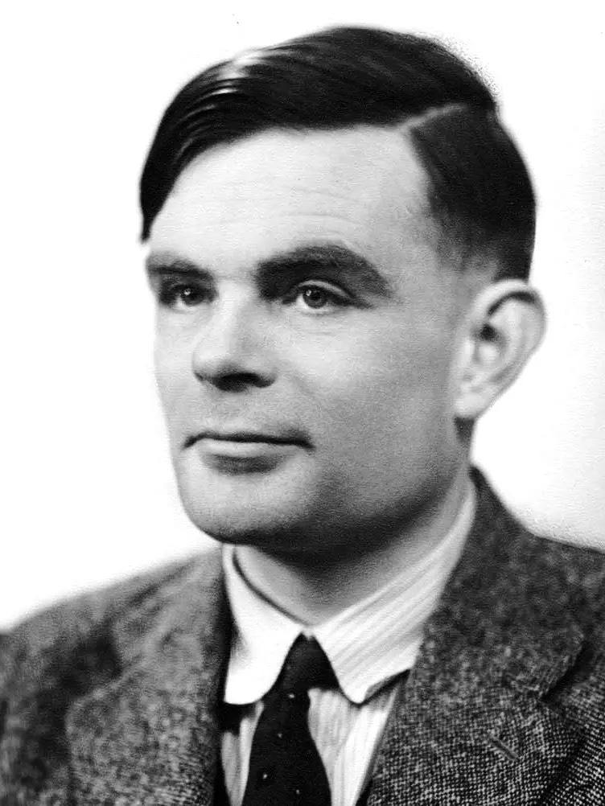
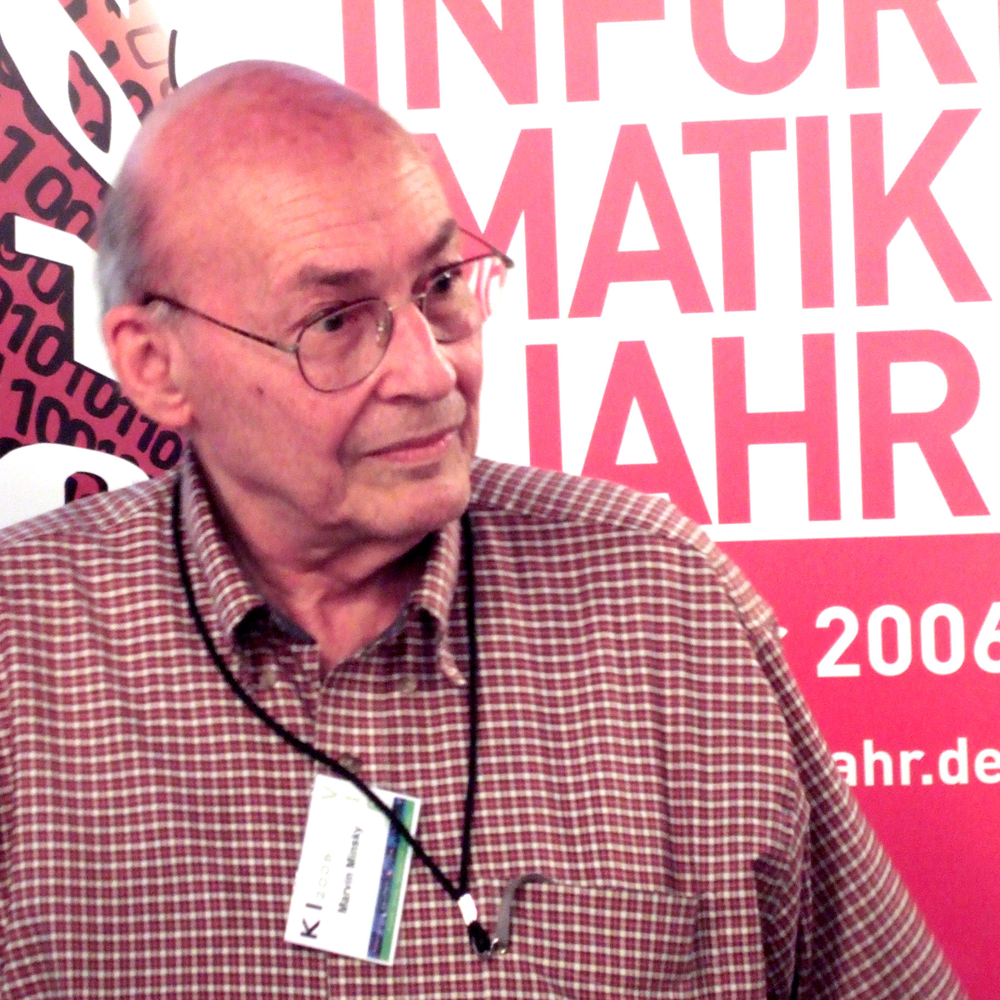

## Genèse et Évolution : La Grande Histoire de l'Apprentissage Automatique

Pour comprendre les architectures modernes et faire des choix technologiques éclairés aujourd'hui, il est indispensable de comprendre comment notre discipline s'est construite. L'histoire de l'Intelligence Artificielle et du Machine Learning n'est pas une ligne droite ; c'est un pendule qui a longuement oscillé entre deux grands paradigmes : l'**IA symbolique** (basée sur la logique et des règles explicites) et le **connexionnisme** (inspiré de la biologie et de l'apprentissage par l'expérience) [@groumpos_2023_ai; @wiki_timeline_ml].

### Timeline

:::: {.timeline .vertical}

::: {.event data-label="1950"}
| Alan Turing | Le Test de Turing |
|:---|:---|
| {width=80px} | *Fondation philosophique* : « Les machines peuvent-elles penser ? » Il pose l'imitation du comportement humain comme standard de réussite. |
:::

::: {.event data-label="1958"}
| Frank Rosenblatt | Le Perceptron |
|:---|:---|
| {width=80px} | *Le Connexionnisme* : Invention du premier réseau de neurones artificiel modélisé sur la biologie, capable d'apprendre par essais et erreurs. |
:::

::: {.event data-label="1969"}
| Minsky & Papert | Le Premier Hiver de l'IA |
|:---|:---|
| {width=80px} | *Désillusion* : Démonstration mathématique des limites du Perceptron simple (XOR). Baisse drastique des financements mondiaux. |
:::

::: {.event data-label="1980 - 1986"}
| Systèmes Experts & Rétropropagation | Le Double Visage des Années 80 |
|:---|:---|
| {width=80px} | *Paradoxe* : Domination de l'IA symbolique menant au 2nd Hiver, pendant que la Rétropropagation du gradient (Hinton, LeCun) est popularisée dans l'ombre. |
:::

::: {.event data-label="Années 1990"}
| Vapnik & Breiman | La Renaissance Statistique |
|:---|:---|
| {width=80px} | *Rigueur mathématique* : Le réseau de neurones est boudé. C'est l'âge d'or des Machines à Vecteurs de Support (SVM) et des méthodes d'ensemble. |
:::

::: {.event data-label="2012"}
| ImageNet & GPUs | Le Big Bang du Deep Learning |
|:---|:---|
| {width=80px} | *Triomphe connexionniste* : Grâce à la convergence du Big Data et des GPUs, le réseau AlexNet pulvérise les méthodes statistiques classiques. |
:::

::::

### Les Pionniers et l'Aube de l'Apprentissage (1950 - 1960)

Tout commence véritablement en 1950 avec Alan Turing. Dans son article fondateur *Computing Machinery and Intelligence*, il pose une question provocatrice : « Les machines peuvent-elles penser ? ». Il y introduit le fameux **Test de Turing**, déplaçant le débat de la philosophie vers l'ingénierie et posant l'imitation du comportement humain comme standard de réussite.

C'est quelques années plus tard, en 1958, que le premier jalon technique du Machine Learning est posé par le psychologue Frank Rosenblatt. Il invente le **Perceptron** [@rosenblatt_1958_perceptron]. C'est le premier réseau de neurones artificiel, modélisé à partir des neurones biologiques. À l'époque, il s'agissait d'une machine physique (le Mark I Perceptron) capable d'apprendre à reconnaître des formes simples par essais et erreurs. Rosenblatt pensait alors que le Perceptron finirait par être capable de marcher, parler, voir et écrire.

### Le Premier Hiver et le Triomphe Temporaire du Symbolique (1969 - 1980)

L'enthousiasme autour du Perceptron va cependant s'effondrer brutalement. En 1969, Marvin Minsky et Seymour Papert publient le livre *Perceptrons*, dans lequel ils démontrent mathématiquement les limites sévères du modèle de Rosenblatt : un Perceptron simple est incapable de résoudre des problèmes non linéaires de base (comme la fonction logique XOR) [@umass_minsky_rosenblatt].

Cette publication, combinée à des promesses technologiques non tenues et au **Rapport Lighthill** [@wiki_lighthill] au Royaume-Uni (qui juge sévèrement les avancées réelles de l'IA), entraîne une coupure drastique des financements gouvernementaux. C'est le premier **Hiver de l'IA (AI Winter)** [@wiki_ai_winter; @alex_2024_ai_winter].

Pendant que le connexionnisme est au point mort, l'IA symbolique prend le relais dans les années 80 avec les **Systèmes Experts**. L'idée n'est plus de faire apprendre la machine, mais d'encoder le savoir humain sous forme de bases de règles complexes ("Si X, alors Y"). Bien qu'utiles en milieu industriel, ces systèmes s'avèrent impossibles à maintenir à grande échelle et totalement inadaptés à l'incertitude ou à la perception (vision, langage naturel).

### La Renaissance Statistique et le Second Hiver (1980 - 2000)

Le marché des systèmes experts s'effondre à la fin des années 80, provoquant un second Hiver de l'IA [@aiws_hardware_1987]. Cependant, dans l'ombre, les bases du renouveau se mettent en place.

En 1986, la technique de la **rétropropagation du gradient (Backpropagation)** est popularisée (notamment par Geoffrey Hinton, Yann LeCun et Yoshua Bengio). C'est une percée majeure : elle permet enfin d'entraîner efficacement des réseaux de neurones multicouches, contournant ainsi le problème soulevé par Minsky 20 ans plus tôt.

Toutefois, dans les années 90, les réseaux de neurones sont encore boudés car trop gourmands en calcul et difficiles à entraîner. Le Machine Learning prend alors un tournant très mathématique et statistique. C'est l'âge d'or des **Machines à Vecteurs de Support (SVM)** et des méthodes d'ensemble (Random Forests), qui dominent la discipline grâce à leurs fondations mathématiques solides et leurs garanties de convergence.

### Le Big Bang du Deep Learning (2012 - Présent)

Pourquoi l'apprentissage profond (Deep Learning), basé sur des concepts des années 80, a-t-il soudainement dominé le monde trente ans plus tard ? L'explication tient en trois vecteurs qui se sont percutés au début des années 2010 :

1. **L'explosion des données (Big Data) :** L'avènement d'Internet et des réseaux sociaux a fourni les quantités massives de données étiquetées nécessaires pour entraîner de grands réseaux.
2. **La puissance de calcul matérielle :** Le détournement des cartes graphiques (GPU), initialement conçues pour le jeu vidéo, a permis de paralléliser les calculs matriciels du Machine Learning, réduisant les temps d'entraînement de plusieurs mois à quelques jours.
3. **Les innovations algorithmiques :** De meilleures fonctions d'activation (ReLU) et techniques d'optimisation ont résolu les problèmes mathématiques qui empêchaient l'entraînement de réseaux très profonds (le problème de la disparition du gradient).

L'année charnière est **2012**, lors de la compétition de vision par ordinateur *ImageNet*. Le réseau de neurones convolutif **AlexNet** pulvérise littéralement les méthodes statistiques classiques, divisant le taux d'erreur par deux. Cet événement signe la victoire éclatante du paradigme connexionniste et ouvre l'ère dans laquelle nous évoluons aujourd'hui, de la vision par ordinateur jusqu'aux modèles génératifs et larges modèles de langage (LLM).