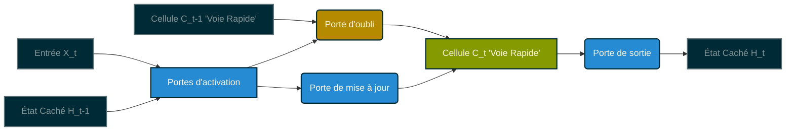

## Solutions à la disparition du gradient et optimisation du paysage

La résolution des problèmes de gradient a été un tournant majeur qui a permis l'émergence des modèles massifs actuels. L'enjeu principal est de transformer un paysage d'optimisation mathématiquement accidenté en une voie praticable et stable pour l'algorithme d'apprentissage [@Sun2025; @Bodin_Recher_3; @Martens_HessianFree].

* **L'utilisation de la fonction ReLU et l'initialisation des poids :**
* En évitant la saturation pour les valeurs positives, la fonction ReLU maintient un flux de gradient sain à travers les couches.

* L'initialisation des poids joue également un rôle fondamental. Une approche comme la *Sparse Initialization* (initialisation creuse), qui limite par exemple à 15 le nombre de connexions non nulles par neurone, prévient la saturation précoce et favorise la différenciation des unités de calcul [@iNeuron_XavierHe; @Kumar2017; @Stanford_CS230].

* **La normalisation par lot (Batch Normalization) :**
* Cette technique a été une véritable révolution. Bien qu'elle ait été longtemps attribuée à la réduction du "décalage de covariable interne" (Internal Covariate Shift), une étude du MIT en 2018 a démontré que son véritable succès réside dans le lissage du paysage d'optimisation.

* Sans cette normalisation, le paysage d'optimisation ressemble à une descente de piste noire glacée et bosselée, pleine de pièges pour l'algorithme.

* Avec elle, ce paysage devient comparable à une autoroute damée ou une piste bleue bien lisse, ce qui permet d'utiliser des taux d'apprentissage beaucoup plus élevés sans risquer la divergence ou l'explosion des gradients [@Ioffe2015; @Sarkar2024; @Youtube_BatchNorm].

* **L'approche architecturale : Les réseaux récurrents avec "portes" (LSTM et GRU) :**
* Face aux données séquentielles, les réseaux profonds classiques souffrent terriblement de la disparition du gradient sur la longueur.
* Les architectures spécialisées introduisent le concept de "portes" (gates), comme la porte d'oubli ou la porte de mise à jour. Ces mécanismes agissent comme des valves mathématiques.

* Elles permettent de préserver l'information pertinente sur de très longues distances temporelles, contournant ainsi physiquement la disparition du gradient en créant des "voies rapides" de transmission de l'information (l'état de la cellule) [@Bourdois2019; @Rosique2017; @ApX_LSTM_GRU; @Scribouillard_Recurrente].

Ces différentes innovations sont ce qui a permis de transformer des modèles purement théoriques en véritables outils de production, capables aujourd'hui de révolutionner le traitement du langage naturel ou des domaines complexes comme la planification urbaine à l'échelle planétaire [@Socher2018; @Wang2023; @AgilityEffect2025; @BaraudSerfaty2019; @Daoudi2018].

